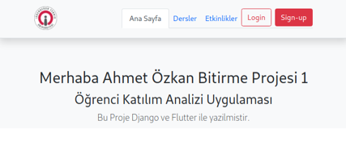
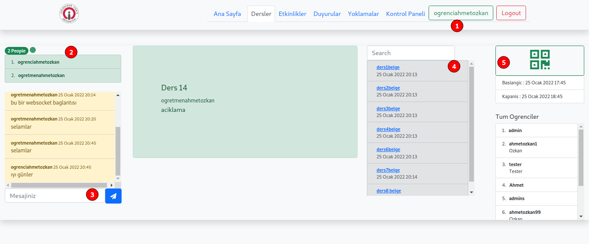

# ÖĞRENCİ KATILIM ANALİZİ UYGULAMASI

# ÖZET

Projem öğrenci katılım analizi, kısaca bir öğrencinin ve öğretmenin derslerini takip edebileceği bir sistem. Web ve mobil olarak tasarlandı. Web tarafında django framework ve admin paneli kullanıldı. Ön yüz tarafta birçok modül kullanıldı bootstrap, css, html, jquery, websocket gibi ana başlıklardaki teknolojiler kullanıldı. Mobil tarafta ise flutter kullanıldı. Mobil taraftaki iletişim django rest framework ile api aracılığıyla sağlandı.

Belli kullanıcı izinleri oluşturuldu. İzinler Öğrenci ve öğretmen olarak ikiye ayrılıyor. Ve bunun içindeki mantıksal yapı ise öğrenci sadece kayıtlı olduğu dersin modüllerine erişebilir. Öğretmen sadece kendi dersinin modüllerini günceller, siler oluşturur gibi kurallar var. Örneğin yoklamayı sadece o dersin hocası oluşturup içeriğini görebilir ve yoklamaya katılım ise sadece o derse kayıtlı öğrenciler tarafından alınabilir. Başka bir dersin öğrencisi qr kodu okuttuğunda o derse kayıtlı olmadığı için uyarı mesajıyla karşılar. Url kısmındaki izinleri yani kullanıcı kayıtlı olmadığı dersin koduyla url‘ den dahi erişemez.

# **İÇİNDEKİLER**

<!-- [ŞEKİLLER LİSTESİ	](#0) -->

<!-- [KULLANICI İZİNLERİ WEB-MOBİL-ADMİN	](#1) -->

[1.KULLANICI İZİNLERİ	](#1)

- [1.1.	Web Site İzinleri	](#11)
<!-- 
[1.1.1.	Admin Yetkisi	](#4)

[1.1.2.	Öğretmen Yetkisi	](#5)

[1.1.3.	Öğrenci Yetkisi	](#6)
-->

- [1.2.	Mobil Uygulama İzinleri	](#12)

<!-- 
[1.2.1.	Öğretmen Yetkisi	](#8)

[1.2.2.	Öğrenci Yetkisi	](#9)  -->

[2.	WEB SİTE MODÜLLERİ	](#2)

- [2.1.	Ana Sayfa	](#21)

- [2.2.	Giriş	](#22)

- [2.3.	Kayıt	](#23)

- [2.4.	Dersler	](#24)
<!-- 
[2.4.1.	Öğretmen	](#15)

[2.4.2.	Öğrenci	](#16)
 -->
- [2.5.	Ders Detayı	](#25)
<!-- 
[2.5.1.	Öğretmen	](#18)

[2.5.2.	Öğrenci	](#19)
 -->
- [2.6.	Yoklamalar	](#26)
<!-- 
[2.6.1.	Öğretmen	](#21)

[2.6.2.	Öğrenci	](#22)
 -->
- [2.7.	Duyurular	](#27)
<!-- 
[2.7.1.	Öğretmen	](#24)

[2.7.2.	Öğrenci	](#25)
 -->
- [2.8.	Etkinlikler	](#28)
<!-- 
[2.8.1.	Öğretmen	](#27)

[2.8.2.	Öğrenci	](#28)
 -->
- [2.9.	Admin Paneli Yönetimi	](#29)
<!-- 
[2.9.1.	Toplu Kayıt Ekleme	](#30) -->

[3.	MOBİL UYGULAMA MODÜLLERİ	](#3)

- [3.1.	Kayıt Ekranı	](#31)

- [3.2.	Giriş Ekranı	](#32)

- [3.3.	Ana Sayfa	](#33)

- [3.4.	Profil Sayfası	](#34)

- [3.5.	Derslerim Sayfası	](#35)
<!-- 
[3.5.1.	Öğretmen Yetkisi (Yeni Ders Ekleme)	](#37)

[3.5.2.	Öğrenci Yetkisi	](#38)
 -->
- [3.6.	Ders Detay Sayfası	](#36)
<!-- 
[3.6.1.	Öğrenci Yetkisi	](#40)

[3.6.2.	Öğretmen Yetkisi	](#41)
 -->
- [3.7.	Tüm Dersler Sayfası (Ders Kaydı)	](#37)

- [3.8.	Yoklamalar Sayfası	](#38)

- - [3.8.1.	Qr Kod Okutma Ve Yoklama Alma Paneli	](#3811)

- - [3.8.2.	Qr Kod Okuma Ve Web Siteden Yoklama Alınması	](#3822)

- [3.9.	Etkinlikler Sayfası	](#39)

- - [3.9.1.	Etkinlik Detayı	](#3911)

- [3.10.	Duyuru Sayfası	](#31)

[4.	PROJE KAYNAK KOD	](#4)

<!-- 
# **ŞEKİLLER LİSTESİ**

[Şekil 2.1-1 Ana sayfa içeriği.	](#211)

[Şekil 2.1-2 Giriş yapılmış kullanıcı için navbar paneli.	](#212)

[Şekil 2.2-1 Giriş ekranı.	](#221)

[Şekil 2.3-1 Kayıt olma ekranı.	](#231)

[Şekil 2.4-1 Sisteme giriş yapılmamış dersler listesi.	](#241)

[Şekil 2.4-2 Öğretmen girişi yapılmış olan dersler bölümü.	](#242)

[Şekil 2.4-3 Öğrenci girişi yapılmış dersler bölümü.	](#243)

[Şekil 2.5-1 Öğretmen girişi yapılmış ders detay sayfası.	](#251)

[Şekil 2.5-2 Yoklama oluşturma paneli.	](#252)

[Şekil 2.5-3 Öğretmen girişi yapılmış ders detayı yoklama aktifliği.	](#253)

[Şekil 2.5-4 Qr kod gösterim ekranı.	](#254)

[Şekil 2.5-5 Öğrenci girişi yapılmış ders detay sayfası.	](#255)

[Şekil 2.6-1 Öğretmen girişi yapılmış yoklamalar sayfası.	](#261)

[Şekil 2.6-2 Yoklama detayı öğretmen erişimi.	](#262)

[Şekil 2.6-3 Öğrenci girişi yapılmış yoklamalar sayfası.	](#263)

[Şekil 2.7-1 Öğretmen girişi duyurular sayfası.](#271)

[Şekil 2.7-2 Duyuru detay sayfası.	](#272)

[Şekil 2.7-3 Duyuru oluşturma sayfası.	](#273)

[Şekil 2.7-4 Öğrenci girişi duyurular sayfası.	](#274)

[Şekil 2.8-1 Giriş yapılmamış etkinlikler sayfası.	](#281)

[Şekil 2.8-2 Öğretmen girişi etkinlikler sayfası.	](#282)

[Şekil 2.8-3 Etkinlik oluşturma paneli.	](#283)

[Şekil 2.8-4 Etkinlik detay sayfası.	](#284)

[Şekil 2.8-5 Öğrenci girişi etkinlikler sayfası.	](#285)

[Şekil 2.9-1 Admin paneli görünümü ve toplu kayıt işlemleri.	](#291)

[Şekil 2.9-2 Excel tablosu örnek.	](#292)

[Şekil 2.9-3 Toplu kayıt eklemede içe aktarma görünümü.	](#293)

[Şekil 3.1-1 Kayıt ekranı.  Şekil 3.1-2 Kayıt ekranı kontrolü.	](#311)

[Şekil 3.1-3 Şifre kontrolü.	](#313)

[Şekil 3.2-1 Giriş ekranı.	](#321)

[Şekil 3.3-1 Ana sayfa.	](#331)

[Şekil 3.4-1 Profil sayfası.	](#341)

[Şekil 3.5-1 Öğretmen ders oluşturma butonu.	](#351)

[Şekil 3.5-2 Öğretmen dersler sayfası.	](#352)

[Şekil 3.5-3 Ders oluşturma sayfası.	](#353)

[Şekil 3.5-4 Öğrenci derslerim sayfası.	](#354)

[Şekil 3.6-1 Ders detay paneli.	](#361)

[Şekil 3.6-2 Mesajlar paneli.	](#362)

[Şekil 3.6-3 Ders yoklamaları paneli.	](#363)

[Şekil 3.6-4 Ders duyuruları paneli.	](#364)

[Şekil 3.6-5 Derse kayıtlı öğrenciler paneli.	](#365)

[Şekil 3.6-6 Ders içi öğretmen yetkileri.	](#366)

[Şekil 3.6-7 Yoklama oluşturma ekranı.	](#367)

[Şekil 3.6-8 Yoklama için tarih modülü.	](#368)

[Şekil 3.6-9 Yoklama için saat modülü.	](#369)

[Şekil 3.6-10 Duyuru oluşturma ekranı.	](#3610)

[Şekil 3.7-1 Tüm dersler sayfası ve kayıt olma modülü.	](#371)

[Şekil 3.8-1 Yoklamalar listesi ve qr kod okuyucu.	](#381)

[Şekil 3.8-2 Qr kod okuyucu ekran ile ilgili kontroller.	](#382)

[Şekil 3.8-3 Qr kod okuttuktan sonraki kontroller.	](#383)

[Şekil 3.8-6 Herhangi bir qr okuyucu ile yoklama alma işlemi.	](#386)

[Şekil 3.8-8 Yoklama alımından sonra kullanıcıya geri dönüş mesajları.	40](#388)

[Şekil 3.9-1 Etkinlikler ve etkinlik oluşturma butonu.	](#391)

[Şekil 3.9-2 Etkinlik detay sayfası.	](#392)

[Şekil 3.9-3 Etkinliğe katılanlar sayfası.	](#393)

[Şekil 3.10-1 Duyuru sayfası ve detay içeriği.	](#3101)
 -->

## 1. KULLANICI İZİNLERİ

Bu çalışmada kullanılmış kullanıcı izinleri öğretmen, öğrenci ve admin olarak 3 tanedir.

##### 1.1. Web Site İzinleri

Web sitemizde admin, öğretmen ve öğrenci olmak üzere 3 adet izin kısıtlaması bulunuyor. Url kısmındaki izinleri yani kullanıcı kayıtlı olmadığı dersin koduyla url‘ den dahi erişemez.

###### Admin Yetkisi
Admin panelindeki yönetimden sorumlu kişidir ve admin panelinde veri tabanı modüllerine erişebilir. Ve gerekli güncellemeleri yapar.

###### Öğretmen Yetkisi

Giriş, kayıt işlemleri. Ders, yoklama, duyuru, etkinlik oluşturma, güncelleme ve silme gibi yönetim işlemlerini yapabiliyor. Ders ekranında ise derse pdf veya excel gibi dosya yükleme işlemleri yapabiliyor. ilgili derse girip websocket bağlantısıyla derse katılanları görebilme ve anlık mesaj iletebilme.

###### Öğrenci Yetkisi

Giriş, kayıt işlemleri. derse kayıt, yoklamaya katılma, duyuruyu okuma, etkinliğe katılma. gibi sadece okuma yapabildiği modüller var. Ve qr kodu okutabilme özelliği. ilgili derse girip websocket bağlantısıyla derse katılanları görebilme ve anlık mesaj iletebilme.

##### 1.2. Mobil Uygulama İzinleri

Mobil uygulamada ise sadece öğretmen ve öğrenci izinleri bulunmakta.
###### Öğretmen Yetkisi
Giriş, kayıt işlemleri. Ders, yoklama, duyuru, etkinlik oluşturma, güncelleme silme gibi yönetim işlemlerini yapabiliyor.
###### Öğrenci Yetkisi
Giriş, kayıt işlemleri, derse kayıt, yoklamaya qr kod ile kayıt ekranı erişimi, etkinliğe katılma, duyurularını görme.

## 2. WEB SİTE MODÜLLERİ

##### 2.1.Ana Sayfa

Burada belirtmek istediğim ana sayfa ve üstte bulunan navbar kısmında belli kullanıcı izinleri bulunuyor. Kullanıcının giriş yapıp yapmadığı veya yoklamalar, ve dashboard navigate işlemlerini erişemiyor.

>  Şekil 2.1--1 Ana sayfa içeriği.

Giriş Yapılmış olan navigation bar da bu şekilde içerikler gelir.

> *Şekil 2.1--2 Giriş yapılmış kullanıcı için navbar paneli.*

##### 2.2.Giriş

Giriş işlemi kullanıcıyı sisteme dahil eder kayıtlı değil ise uyarı ile bilgi verir.

> Şekil 2.2--1 Giriş ekranı.

##### 2.3.Kayıt

Kayı işleminde öğretmen veya öğrenci kaydı yapılabiliyor.

>  Şekil 2.3--1 Kayıt olma ekranı.

##### 2.4.Dersler

Dersler bölümünde yine kullanıcı izinlerine bağlı olarak değişen özellikler mevcut. Sisteme giriş yapmamış kullanıcı için sadece sistemdeki ders listesini görebiliyor. Eğer sisteme giriş yapmış ise kullanıcı öğretmen veya öğrenci olması durumuna göre ders ekle butonu gözüküyor. Eğer kullanıcı derse kayıt olmuşsa ders içeriği ve kayıtlı değilse derse kayıt ol butonu gösteriliyor.

>  Şekil 2.4--1 Sisteme giriş yapılmamış dersler listesi.

###### Öğretmen

Öğretmen girişi mevcut ise aşağıdaki gibi bir sayfa gözüküyor burada ders oluştur butonu var.

1. Öğretmen girişi yapılmış.
2. Ders oluştur butonu sadece öğretmen ise gözükür.
3. Kayıtlı olduğu dersin içeriğini görebilme.

> Şekil 2.4--2 Öğretmen girişi yapılmış olan dersler bölümü.

###### Öğrenci

Öğrenci girişi yapılmış bir kullanıcının dersleri gördüğü sayfa.

1. Dersler sayfası listeleniyor.
2. Kullanıcı girişi.
3. Derse kayıtlı ise ders içeriği görme butonu.
4. Derse kayıtlı değilse kayıt ol butonu.

>  Şekil 2.4--3 Öğrenci girişi yapılmış dersler bölümü.

##### 2.5.Ders Detayı

Ders detayın da en önemli unsun websocket bağlantısının olması. Kullanıcılar derse giriş yaptıklarında sisteme dahil olurlar ve online olan kişiler otomatik herkeste eşzamanlı olarak gösterilir. Mesaj iletme bölümü de gönderilen mesaj herkese eşzamanlı olarak iletilir. Böylece websocket bağlantısıyla sistemde aynı anda aktif bulunmaktayız.

###### Öğretmen

Dersin öğretmeni derse eriştiği zaman ilk önce websocket çalışıyor ve online listesine ekleniyor. Resimdeki içerikler şu şekildedir.

###### Ders Ekranı Görünümü

1. Öğretmenin giriş yaptığı bilgisi.
2. Online kullanıcılar listesi. Öğrenciler sisteme aktif olduklarında bu liste yenileniyor
ve herkes tarafından anlık gösteriliyor. Ve bağlantı kopukluğunda kırmızı bir sinyal
ile bağlantının kesildiği gösteriliyor. Şu anda yeşil yanıp sönmekte.
3. Anlık mesajlaşma modülü yeşil ile gösterilen aslında yeni bir mesaj ve herkese
anlık ulaştırıldığı biliniyor. Geçmiş tarihteki mesajlar ise sarı kutucukta listeleniyor
4. Öğretmenin derse ait belge yüklemesi için oluşturuldu.
5. Derse yüklenmiş olan dosyaları listeleniyor tarihe göre. Ve öğretmen bunu listeden
kaldırabilir.
6. Öğretmen bulunduğu ders için yoklama aktif edebilir.
7. Ders kayıt yaptırmış tüm öğrenciler listelenmekte.

>  Şekil 2.5--1 Öğretmen girişi yapılmış ders detay sayfası.

###### Yoklama Oluşturma

Yoklama aktif et butonuyla birlikte öğretmen açılan ekrandan yoklama tanımlaması yapabilir.

1. Öğretmen girişi
2. Yoklamayı aktif et butonu
3. Yoklama oluşturma paneli sayfada eşzamanlı olarak açılır.
4. Oluştur onay butonu.

>  Şekil 2.5--2 Yoklama oluşturma paneli.

###### Qr Kod Aktifleştirilmesi

Öğretmen yoklama oluşturduğunda bu şekilde bir panel değişikliği olur yoklama bilgisi ve sonlandırma butonu gözükür. Ayrıca qr kod butonu buna basınca kullanıcı ilgili yoklamanın qr koduna erişir.

1. Öğretmen girişi.
2. Yoklama oluşturulduğuna dair onay mesajı.
3. Qr kod butonu yoklamanın qr kodu açılır.
4. Yoklamayı sonlandırma butonu.
5. Yoklamanın belirtilen tarihi.

> Şekil 2.5--3 Öğretmen girişi yapılmış ders detayı yoklama aktifliği.

###### Qr Kod Gösterimi

Oluşturulan yoklamanın qr kodunu bu şekilde ekranda görebiliyoruz bunu okuttuğumuzda yoklamanız alınmış olur eğer dersin öğrencisiyseniz.

1. Yoklamanın qr butonu
2. Qr gösterilmesi için açılan panel
3. Qr kodumuz.

>  Şekil 2.5--4 Qr kod gösterim ekranı.

###### Öğrenci

Öğrenci ekranında ise görünüm aynı websocket ile online olup anlık mesaj gönderebilir. Yoklama aktif ise qr koda erişip yoklamaya katılabilir.

###### Ders Ekranı Görünümü

1. Öğrenci girişi.
2. Online kullanıcılar websocket ile anlık bağlantılı. Yeni gelen kullanıcı oraya
eklenir.
3. Mesajlaşma modülü anlık olarak mesaj gönderip alabilir.
4. Derse ait yayınlanmış olan ders notlarını görebilir indirebilir.
5. Qr kod butonuyla o anki yoklamaya erişip telefonuyla yoklamaya katılabilir.

>   Şekil 2.5--5 Öğrenci girişi yapılmış ders detay sayfası.

##### 2.6. Yoklamalar

Yoklamalarda da belirlenmiş izinler mevcut. Bunlar öğrenci sadece kendi dersinin yoklamalarını görür. Öğretmen sadece kendi dersinin yoklamalarında işlem yapabilir. Başka bir öğretmen diğer derslerin yoklamalarına erişemez. Yoklama kapandıysa qr kod erişilemez hale gelir. Resim olarak fotoğrafı çekilse bile sistemde kapandığı için yoklama almak isteyen öğrenci yoklamaya dahil olamaz.

###### Öğretmen

Öğretmen yoklamaları bu şekilde görür ve işlem yapar. Bu ekrandaki yoklamalar giriş yapmış kullanıcıya göre listelenir. Örneğin kullanıcının kayıtlı olmadığı derslerin yoklamaları listelenmez.

1. Öğretmen girişi yapılmış.
2. Öğretmenin kendi dersine ait bir yoklama.
3. Öğretmenin yine kendi dersine ait kapanmış bir yoklama
4. Giriş yapmış kullanıcın kayıtlı olduğu başka bir ders öğretmeni farklı.
5. Yoklamanın aktiflik durumu yoklama aktif ise yeşil yanıp sönen belirteç veya
kapanmış ise kırmızı bir kapandı yazısı.
6. Qr kod sütununda ise eğer yoklama hala aktif ise qr kod ikonuyla bir buton mevcut.
Bu butona tıklandığında ilgili yoklamanın qr kodu gözükür.
7. Eğer giriş yapmış kişi o dersin öğretmeniyse detaya git kısımdaki buton aktiftir ve
yoklamanın detay sayfasına erişebilir.
8. Yoklamayı sonlandır butonu yoklama aktif ise dersin öğretmeni tarafından görülen
kapat butonu gözüküyor. Yoklama kapalı ise gözükmüyor.

>  Şekil 2.6--1 Öğretmen girişi yapılmış yoklamalar sayfası. 

>Yoklamaları istenilen derse göre arama seçeneği.

>Aranan dersin yoklama listesi.

###### Yoklama Detayı

Sadece dersin öğretmeni erişebilir.

1. Öğretmen girişi.
2. Dersin öğretmen bilgisi.
3. Tüm öğrenciler listelenir ve katılıp katılmadığı bilgisi.
4. Sadece yoklamaya katılan öğrenciler listelenir.

> Şekil 2.6--2 Yoklama detayı öğretmen erişimi.

###### Öğrenci

Öğrenci ekranında ise kayıtlı olduğu dersin yoklamalarını görüyor. Qr koda erişip katılabiliyor.

1. Öğrenci girişi mevcut.
2. Öğrencinin kayıtlı olduğu yoklaması aktif olan ders.
3. Öğrencinin kayıtlı olduğu yoklaması kapalı ders.
4. Yoklamanın aktiftik durumu.
5. Qr kod butonu yoklama aktif ise gözükür.

>  Şekil 2.6--3 Öğrenci girişi yapılmış yoklamalar sayfası.

##### 2.7.Duyurular

Duyurular öğretmen tarafından oluşturulur. Dersin öğretmeni tarafından o derse ait bir duyuru oluşturulabilir. İlgili derse kayıtlı kişiler o duyuruyu görebilir.

###### Öğretmen

Öğretmen kendi dersine ait veya kayıtlı olduğu derslerin duyurularını görebilir.

1. Öğretmen girişi.
2. Duyuru oluşturma butonu.
3. Kayıtlı olunan dersin bir duyurusu.
4. Öğretmeni olduğu bir dersin duyurusu
5. Duyuru detayı kayıtlı olunan tüm ders duyurularının içeriğine erişebilir.
6. Kendi dersinin duyurusunu güncelleme.
7. Duyuru silme.

>  Şekil 2.7--1 Öğretmen girişi duyurular sayfası.

###### Duyuru Detayı

Derse kayıtlı kullanıcı tarafından görülen duyuru detay sayfası

> Şekil 2.7--2 Duyuru detay sayfası.

###### Duyuru Oluşturma

Sadece öğretmen oluşturabilir ve öğretmen kendi derslerinin duyurularını oluşturabilir başka derslerin duyurularını oluşturamaz. Bu derler bir liste halinde gelir.

>  Şekil 2.7--3 Duyuru oluşturma sayfası.

###### Öğrenci
Sadece kayıtlı olduğu derslerin duyurularının listesini görebilir ve içeriğine bakabilir.

> Şekil 2.7--4 Öğrenci girişi duyurular sayfası.

##### 2.8.Etkinlikler

Etkinlikler sayfamızda öğretmen isteği etkinliği oluşturabilir. Öğrenci etkinliğe kayıt olup içeriğini görebilir. Her iki kullanıcı modeli de etkinliğe kayıt yapıp içeriğini görebilir.

>  Şekil 2.8--1 Giriş yapılmamış etkinlikler sayfası.

###### Öğretmen

Etkinlik oluşturabilir ve yayınlayabilir.

> Şekil 2.8--2 Öğretmen girişi etkinlikler sayfası.

###### Etkinlik Oluşturma Paneli

Giriş yapmış öğretmen 3 numaralı buton ile etkinlik oluşturma sayfasına gider.

>  Şekil 2.8--3 Etkinlik oluşturma paneli.

###### Etkinlik Detay Sayfası

>  Şekil 2.8--4 Etkinlik detay sayfası.

######  Öğrenci
Öğrenci sadece etkinliğe kayı olup içeriğini takip edebilir.

> Şekil 2.8--5 Öğrenci girişi etkinlikler sayfası.

##### 2.9. Admin Paneli Yönetimi

Sadece admin yetkisi gereken kişiler erişebilir ve gereken değişiklikleri yapabilir. Toplu kayıt ekleme ve dışa aktarma gibi işlemler yapılabilmektedir.

######    Admin
###### Toplu Kayıt Ekleme
panelinde veri tabanından çekilen objeler gösterilmekte.

1. Admin girişi.
2. Kullanıcı yönetimi.
3. Ders ve etkinlik yönetimleri.
4. Toplu kayıt ekleme.
5. Sistemden toplu kayıt dışarıya alma.

>  Şekil 2.9--1 Admin paneli görünümü ve toplu kayıt işlemleri. Oluşturmuş olduğum bir xlsx dosyası bunu içeriye aktardım.

> Şekil 2.9--2 Excel tablosu örnek.

İçe aktarma onayında eğer kullanıcı sistemde yok ise onaylanacaktır.

1. İçe aktarma modülü.
2. Onay butonu içerik düzgün bir şekilde olursa gelir.
3. Ön izleme ekranı burada verilerin nasıl aktarılacağı gözüküyor. Password alanını
sistemde ki kullanıcı kaydında olduğu gibi şifreli bir şekilde veri tabanına kayıt eder.

>  Şekil 2.9--3 Toplu kayıt eklemede içe aktarma görünümü.

###### İçeri aktarma onay sayfası.
1. İlgili ders seçimi
2. Eklenecek kişilerin listesi.
3. Onay butonu

>Onaylanmış işlem görüntüsü.

>Seçilen derse eklenmiş kişiler ve işlemin onaylandığını görüyoruz.

## 3. MOBİL UYGULAMA MODÜLLERİ

##### 3.1.Kayıt Ekranı
Kayıt ekranı api ile haberleşip bir post isteği gönderip verilerin doğru sonucu döndürürse kayıt işlemi gerçekleşir. Eğer veriler istenilen biçimde olmaz ise api den gelen cevabı kullanıcıya açık bir şekilde belirtir. Kullanıcı adı var olan veya mail var olan kullanıcıyı sisteme kayıt etmez. Şifre için benzersiz alan olması, isme çok benzer olması veya şifre 8 haneden az olması gibi uyarılarda bulunulur.

Öğretmen kaydı için öğretmen kutucuğunun işaretli olması gerekir.

> Şekil 3.1--1 Kayıt ekranı. Şekil 3.1--2 Kayıt ekranı kontrolü.

> Şekil 3.1--3 Şifre kontrolü.

##### 3.2.Giriş Ekranı

Kullanıcı eğer sistemde kayıtlı ise giriş yapabilir. Ama kayıtlı değil ise api den kullanıcıya bir hata mesajı döndürür bu sayede kullanıcı doğru bir şekilde sisteme dahil olur.

>  Şekil 3.2--1 Giriş ekranı.

##### 3.3.Ana Sayfa

Eğer kullanıcı girişi olumlu gerçekleşirse ana sayfaya yönlendirilir. Burada kullanıcı her uygulamaya her açtığında bir kere giriş yaptığı için her zaman ana sayfa açılır. Eğer çıkış işlemi gerçekleştirir ise tekrar giriş ve kayıt sayfası açılır.

1. Giriş yapmış kullanıcının profil bilgilerine erişmesi için buton.
2. Çıkış yapmak için kullanılan buton.
3. Kullanıcın kendi kayıtlı olduğu derslerin listesi.
4. Kullanıcının kayıtlı olmadığı sistemdeki tüm dersler listelenir.
5. Kullanıcının kayıtlı olduğu derslerin tüm yoklamaları listelenir.
6. Sistemdeki öğretmenler tarafından oluşturulmuş etkinlikler listelenir.
7. Kayıtlı olunan derslerin duyuruları listelenir.

>  Şekil 3.3--1 Ana sayfa.

##### 3.4.Profil Sayfası

Giriş yapmış kullanıcı kendi bilgilerini profil sayfasından görebilir. Yetkisi öğretmen olan kullanıcı mevcut fotoğrafta.

>  Şekil 3.4--1 Profil sayfası.

##### 3.5.Derslerim Sayfası

###### Öğretmen Yetkisi (Yeni Ders Ekleme)

Öğretmen kayıtlı olduğu veya kendine ait derslerin listesini görür. Ve üstte bulunan 3 nokta ile gösterilen (PopupMenuButon) ile yeni ders ekleme seçeneğini görür ve oradan yeni ders ekleme sayfasına gidebilir.

> Şekil 3.5--1 Öğretmen ders oluşturma butonu.

> Şekil 3.5--2 Öğretmen dersler sayfası.

###### Yeni Ders Ekleme Sayfası

Öğretmen sistemdeki derslerin isimleri benzersiz alan olduğundan farklı bir isim ile yeni ders oluşturabilir.

>  Şekil 3.5--3 Ders oluşturma sayfası.

###### Öğrenci Yetkisi

Öğrenci sadece kayıtlı olduğu dersleri görebilir ve içeriğine gidebilir.

>   Şekil 3.5--4 Öğrenci derslerim sayfası.

##### 3.6.Ders Detay Sayfası

İlgili dersin detayları gösterilir.

###### Öğrenci Yetkisi

Ders detayı girdiğimizde 5 tane tab panel karşımıza çıkıyor.

###### Ders Detay Paneli

Burada derse ait bilgiler ve dersin yüklenmiş olan dosyaları gösterilmek için tasarlandı.

>   Şekil 3.6--1 Ders detay paneli.

###### Mesajlar Paneli

Mesajlar ise aslında websocket bağlantısı olarak anlık çalışması planlandı. Şuanda normal api post işlemi yapabiliyor ve geçmiş mesajları gösteriyor.

>  Şekil 3.6--2 Mesajlar paneli.

###### Yoklamalar Paneli

Yoklamalar panelinde derse ait geçmiş veya güncel yoklamalar listelenmekte.

>  Şekil 3.6--3 Ders yoklamaları paneli.

###### Duyurular Paneli

Derse ait duyurular listelenir.

>  Şekil 3.6--4 Ders duyuruları paneli.

###### Öğrenciler Paneli

Derse kayıtlı tüm öğrenciler listelenir.

> Şekil 3.6--5 Derse kayıtlı öğrenciler paneli.

###### Öğretmen Yetkisi

Öğretmen ders detay sayfasından 2 tane modüle erişebilir.

1. Bulunduğu ders için yoklama oluşturma seçeneği
2. Duyuru oluşturup yayınlama seçeneği.

>  Şekil 3.6--6 Ders içi öğretmen yetkileri.

###### 1-Yoklama Oluşturma Paneli

Öğretmen kendi dersi için yoklama oluşturabileceği bir panel ile tarih zamanı kolayca seçip oluşturabilir. Api ile sisteme ilgili yoklama kayıt olur ve qr kod hazır olur.

>  Şekil 3.6--7 Yoklama oluşturma ekranı.

> Şekil 3.6--8 Yoklama için tarih modülü.

>  Şekil 3.6--9 Yoklama için saat modülü.

###### 2- Duyuru Oluşturma Paneli

Öğretmen ilgili ders için duyuru ekranından duyuru oluşturup yayınlayabilir.

> Şekil 3.6--10 Duyuru oluşturma ekranı.

##### 3.7.Tüm Dersler Sayfası (Ders Kaydı)

Burada giriş yapmış kullanıcı kendini derse kayıt edebiliyor ve kayıtlı olduğu derslerim sayfasından erişebiliyor.

>  Şekil 3.7--1 Tüm dersler sayfası ve kayıt olma modülü.

##### 3.8.Yoklamalar Sayfası

Giriş yapmış olan kullanıcı kayıtlı olduğu derslerin yoklamalarına erişebiliyor. Yoklamaları katılıp katılmadığı bilgisi ve yoklamanın aktiflik bilgisini görebiliyor. Qr kod butonu ile birlikte qr kod okutma ekranına yönlendiriliyor.

>  Şekil 3.8--1 Yoklamalar listesi ve qr kod okuyucu.

###### Qr Kod Okutma Ve Yoklama Alma Paneli

Burada kullanıcı qr kod butonu ile birlikte qr paneli açılır. Temel özellikleri qr okuyup yoklamanızı otomatik alır. Herhangi bir dersin qr ı olabilir ve okutabilir. Tabi bunun kontrolleri uygulama içerisinde yapılmakta görsellerde de mevcut.

1. Telefonun kamera aydınlatmasının açılması için buton.
2. Telefonun ön veya arka kamerası için geçiş butonu.
3. Qr kod okutulacak panel qr kodu bu çerçeveye tuttuğumuzda hızlı bir şekilde
okuyup bize dönen mesajı gösterir.
4. Bilgi mesajı bölümü burada qr kod okutulunca veya okutmazdan önceki bilgiler
gösterilir.
5. Yoklama kapanmış ise bu mesaj gösterilir.
6. Yoklama başarılı bir şekilde alınmış ise bu mesaj gösterilir.
7. Eğer kullanıcı derse kayıtlı değil ise bu mesaj gösterilir.

>  Şekil 3.8--2 Qr kod okuyucu ekran ile ilgili kontroller.

> Şekil 3.8--3 Qr kod okuttuktan sonraki kontroller.

###### Qr Kod Okuma Ve Web Siteden Yoklama Alınması

Uygulama dışındaki herhangi bir qr kod uygulamasıyla okutulduğu zaman bizi giriş sayfasına yöneltiyor yani mobil uygulama olmadan da ilgili yoklama alınabiliyor.
Qr koddan elde ettiğimiz link bilgisi bizi tarayıcıya yönlendiriyor ve yoklamanın bilgileri gösteriliyor. Ardından kullanıcı sistem doğrulamasından sonra yoklaması onaylanır.

>   Şekil 3.8--4 Herhangi bir qr okuyucu ile yoklama alma işlemi.

###### Geri bildirim mesajları kullanıcı sisteme giriş yaptıktan sonra.

1. Kullanıcı ilgili yoklamamın dersine kayıtlı değilse bir uyarı mesajıyla bunu beliriyoruz.
2. Yoklama kapandıysa kullanıcı yoklamaya katılamaz.
3. Yoklamaya katılırsa yoklamanız alındı mesajı görecektir.

>    Şekil 3.8--5 Yoklama alımından sonra kullanıcıya geri dönüş mesajları.

##### 3.9.Etkinlikler Sayfası

Sistemdeki etkinlikler listelenir ve öğretmen etkinlik oluşturabilir.

>  Şekil 3.9--1 Etkinlikler ve etkinlik oluşturma butonu.

###### Etkinlik Detayı

Etkinlik içeriğine erişilebilir ve katılanlar gösterilir.

>  Şekil 3.9--2 Etkinlik detay sayfası.

> Şekil 3.9--3 Etkinliğe katılanlar sayfası.

##### 3.10. Duyuru Sayfası

Giriş yapmış kullanıcın kayıtlı olduğu derslere ait duyurular listelenir ve içeriğini görebilir.

> Şekil 3.10--1 Duyuru sayfası ve detay içeriği.

## 4. Proje Kaynak Kod Dosyaları

4.1. Web Django
https://github.com/ahmetozkanio/student_project_bitirme_django

4.2. Mobil Flutter
https://github.com/ahmetozkanio/student_project_bitirme_flutter

      

